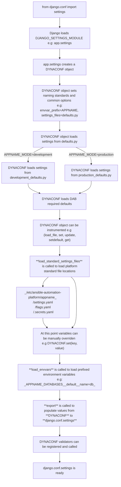
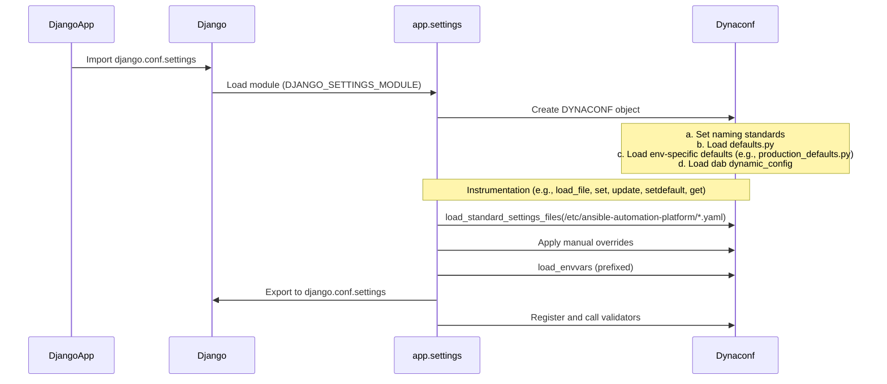

# Dynamic Configuration

Application configuration is managed by [dynaconf] a dynamic configuration system that allows you to define configuration settings in a variety of formats and sources.

Django Ansible Base provides a set of functions to help Ansible Applications to instantiate
the dynaconf object, load settings from standard locations, export settings back to django settings and more.

On top of Dynaconf, Django Ansible Base also defines a set of standards for file locations, environment variable naming, and settings validation.


## Integrating a DAB service with Dynaconf


Django settings lifecycle starts by loading the `DJANGO_SETTINGS_MODULE` module, which is usually the `settings` module inside the application, that is the place where the Dynaconf object is created and the settings manipulated to be exported back to Django settings.

That could be done by creating Dynaconf instance directly on the Django app setttings file,
but DAB helpers are provided to make this process easier and more standardized.

Start by importing the functions from `ansible_base.lib.dynamic_config`:

`myapp/settings.py`:
```python
from ansible_base.lib.dynamic_config import (
    factory,  # Create a dynaconf object
    export,  # Export dynaconf settings back to django.conf.settings
    load_envvars, # Load settings from environment variables
    load_standard_settings_files, # Load settings from standard locations
    toggle_feature_flags, # Toggle feature flags based on values set by installer or envvars
)
```

Those functions are provided separately to allow the application to choose which ones to use and which
order to call them.

### Creating the Dynaconf object

Assuming `DJANGO_SETTINGS_MODULE` is set to `myapp.settings`:

On the `settings` module (`settings.py` or `settings/__init__.py`), create an object named 
`DYNACONF` using the `ansible_base.lib.dynamic_config.factory` function.

The `factory` function will accept the following arguments:

- **module_name**: The name of the module
  The module_name is used to determine the caller module path.
- **app_name**: The name of the application
  This name is used to determine some configuration defaults such as the main envvar prefix `{NAME}_` and the standard settings file name on `/etc/ansible-automation-platform/{name}/settings.yaml` and the mode switcher on `{name}_MODE`.
- **extra_envvar_prefixes**: A list of environment variable prefixes to search for settings
  If the application needs to load settings filtering additional prefixes, this list can be used to specify them.
- **options**: Additional options to pass to dynaconf
- **validators**: A list of dynaconf.Validator objects to validate the settings after loading
- **add_dab_settings**: A boolean to toggle the addition of DAB required settings, if set to false, 
  then the function `load_dab_settings` can be called later to load the DAB settings.


`myapp/settings.py`:
```python
DYNACONF = factory(
    __name__,
    "MYAPP",
    # Options passed directly to dynaconf
    environments=("development", "production", "testing"),
    settings_files=["defaults.py"],
    validators=[
        Validator("KEY", required=True),
        Validator("NUMBER", is_type_of=int, gte=0, lte=100),
        Validator("LIST", len_min=1, when=Validator("OTHER", eq="value")),
        Validator("DICT", condition=lambda x: x.get("key") == "value"),
    ],
)
```

With the above configuration DYNACONF will load 

- settings passed directly to the factory function if any upper case variable is passed.
- settings from `defaults.py` file
- settings from `development_defaults.py` file if the file exists and the mode is development (which is the default mode)
- settings from `production_defaults.py` file if the file exists and the mode is production (set with `export MYAPP_MODE=production`)
- required settings from `django_ansible_base` dynamic configuration (DAB) if `add_dab_settings` is set to `True` (which is the default) in the case you want to load the DAB settings later, set it to `False` and call `load_dab_settings(DYNACONF)` later.

### Manipulating the DYNACONF object

Inside the `settings` module the DYNACONF object is available to be instrumented in any way needed,
read more on [dynaconf] documentation to see how to use the settings object.

From outside the `settings` module the DYNACONF object can be accessed from `django.conf.settings.DYNACONF`.

The basic operations are:

#### Read a setting 

> DYNACONF is a dict-like object that also exposes attribute lookup.

```python
DYNACONF.get("key")
DYNACONF.key
DYNACONF.key.subkey
DYNACONF["key"]
```

#### Set a setting

```python
DYNACONF.set("key", "value")
DYNACONF.set("key__subkey", "value")
DYNACONF.set("key.subkey", "value")
DYNACONF.key = "value"
DYNACONF.key.subkey = "value"
DYNACONF["key"] = "value"
DYNACONF.update({"key": "value"})
DYNACONF.setdefault("key", "value")
```

NOTE: When manipulating the setting, the operation is stored in the inspection history only if the `loader_identifier` passed, e.g: `DYNACONF.update({"key": "value"}, loader_identifier="set_foo")`


#### Load extra files 

```python
DYNACONF.load_file("path/to/file.yaml")
DYNACONF.load_file("path/to/file.toml")
DYNACONF.load_file("path/to/file.json")
DYNACONF.load_file("path/to/file.ini")
DYNACONF.load_file("local_*.py")
DYNACONF.load_file("/etc/location/conf.d/*.py")
```

> [!NOTE]  
> Every time a key is set, or a new file is loaded, Dynaconf will apply **merging** rules to the settings, so the last loaded file or the last set key will override the previous ones.
> Dynaconf has some merging strategies that can be configured, read more on [dynaconf] documentation.
> By default the latest set key will completely override the previous one.
> unless it explicitly uses one of the `@merge`. "@merge_unique", "@insert" or "dynaconf_merge" directives.
>
> If `merge=True` is passed to the `factory` function, then dynaconf will operate on the global merging > strategy, which means lists and dictionaries will be merged back to previous by default (even without the directives) instead of replaced.
>
> Notice that DAB doesn't use the `merge=True` option by default, so the default behavior is to replace the previous settings, this allows more granular control over the settings merge.


#### Check the current mode 

For example `export MYAPP_MODE=production` will set the mode to production,
modes can also be composed like `export MYAPP_MODE=production,extra`

```python
DYNACONF.is_development_mode # True if development
"production" in DYNACONF.current_env.lower() # True if production
```

#### Loading Standard Ansible Automation Platform settings files

The `load_standard_settings_files` function will load settings from the standard locations,
the base location is standardized as `/etc/ansible-automation-platform/` and the function will load
in order.

- `/etc/ansible-automation-platform/{settings, flags, .secrets}.yaml`
- `/etc/ansible-automation-platform/{name}/{settings, flags, .secrets}.yaml`

where `{name}` is the lowercase name passed to the factory function.

```python
load_standard_settings_files(DYNACONF)
```

Those files will be loaded in order and the merging strategy will be applied.

#### Load settings from environment variables

The `load_envvars` function will load settings from environment variables using the standard prefix
`{NAME}_` where `{NAME}` is the upper name passed to the factory function.

```python
load_envvars(DYNACONF)
```

and then the settings can be externally overridden as:

```bash
export MYAPP_KEY=value
export MYAPP_KEY__SUBKEY=value
export MYAPP_DATABASES__default__NAME=mydb
export MYAPP_NUMBER=42
export MYAPP_LIST="[1, 2, 3]"
export MYAPP_DICT='@json {"key": "value"}'
# or a valid toml
export MYAPP_DICT='{key="value"}'
export MYAPP_BOOL=true
export MYAPP_FLOAT=3.14
export MYAPP_INTERPOLATE="@format The key value is {this.KEY}"
export MYAPP_INTERPOLATE_COMPLEX="@int @jinja {{ this.NUMBER * 4}}"
export MYAPP_INSTALLED_APPS="@merge new_app_to_add"
```

More on [dynaconf] documentation.


### Export settings back to django settings

The export function will take all variables from the dynaconf object and export them back to django settings so it will be available as `django.conf.settings`:

It is important to call this function at the very end of the `settings` module.

```python
export(__name__, DYNACONF)
```

All the registered Validators will be called before exporting the settings.


## Setting Settings 

With Dynaconf, settings can come from a variety of sources, each service can define individually its default settings that can be either hardcoded passed directly to the factory function or loaded from a file defined as the `settings_files` option,
then DAB after loading the defaults will conditionally inject its own required settings depending on the `INSTALLED_APPS` 
settings, then in the settings.py each service can manipulate the dynaconf object individually in order to set new settings, load extra files, or override the defaults.

DAB also provides helpers to load settings from standard locations and environment variables, and to validate the settings.

### Defaults

Assuming `settings_files=["defaults.py"]` is passed to the factory function, the `defaults.py` file will be loaded by default.

`myapp/defaults.py`:
```python
DATABASES = {
    "default": {
        "ENGINE": "django.db.backends.sqlite3",
        "NAME": "db.sqlite3",
    }
}
DEBUG = False
ANYTHING = "value"
```

Each service can name that file differently, but the `defaults.py` is a convention, it is also possible to pass multiple files to the `settings_files` option, so dynaconf loads them in order and applies the merging strategy to overrides the previous loaded settings, the `settings_files` option can also be paths to files in formats such as `yaml`, `json`, `toml`, `ini`, or python files.

If the service prefers, the defaults can be passed directly to the factory function as a uppercase variables, but the file is recommended to keep the settings organized and have better visualization when inspecting the settings.

```python
DYNACONF = factory(
    __name__,
    "MYAPP",
    # defaults
    DATABASES={
        "default": {
            "ENGINE": "django.db.backends.sqlite3",
            "NAME": "db.sqlite3",
        }
    },
    DEBUG=False,
    ANYTHING="value",
)
```

### Environment Variables

Environment variables can be used to override the settings, the standard prefix is `{NAME}_` where `{NAME}` is the uppercase name passed to the factory function, but extra prefixes can be passed to the `load_envvars` function.

```bash
export MYAPP_KEY=value
export MYAPP_KEY__SUBKEY=value
export MYAPP_DATABASES__default__NAME=mydb
export MYAPP_NUMBER=42
export MYAPP_LIST="[1, 2, 3]"
export MYAPP_DICT='@json {"key": "value"}'
# or a valid toml
export MYAPP_DICT='{key="value"}'
export MYAPP_BOOL=true
export MYAPP_FLOAT=3.14
export MYAPP_INTERPOLATE="@format The key value is {this.KEY}"
export MYAPP_INTERPOLATE_COMPLEX="@int @jinja {{ this.NUMBER * 4}}"
export MYAPP_INSTALLED_APPS="@merge new_app_to_add"
```

### Merge Strategy

As Dynaconf will load multiple sources separately in order to build the final state of the settings, there are
some common Django patterns that works in a different with Dynaconf.

In the scope of a Dynaconf settings file, it is not possible to `import` the previous loaded file to 
assert conditionals or to merge settings, but Dynaconf provides a set of directives that can be used to merge settings.

Dynaconf has multiple ways of defining the intention to merge a setting with previously loaded settings.

#### Converters


- `@merge` will merge the setting with the previous one, if the setting is a list or a dictionary, the new setting will be appended to the previous one.
    - ```python
      INSTALLED_APPS = "@merge new_app_to_add"
      ``` 
      Converts to `INSTALLED_APPS.append("new_app_to_add")`<br><br>
    - ```python
      INSTALLED_APPS = "@merge new_app1,new_app2"
      ```
      Converts to `INSTALLED_APPS.extend(['new_app1', 'new_app2'])`<br><br>  
    - ```python
      DATABASES = "@merge {'default': {'ENGINE': 'django.db.backends.sqlite3', 'NAME': 'db.sqlite3'}}"
      ```
      Converts to `DATABASES.update({'default': {'ENGINE': 'django.db.backends.sqlite3', 'NAME': 'db.sqlite3'}})`  <br><br>
    - ```python
      PERSON = "@merge name=John"
      ```
      Converts to `PERSON.update({'name': 'John'})`<br><br>  

- `@merge_unique` will merge the setting with the previous one, but only if the setting is not already present in the previous one.
    - ```python
      INSTALLED_APPS = "@merge_unique new_app_to_add_only_if_not_present_yet"
      ```
      Converts to `if "new_app" not in INSTALLED_APPS: INSTALLED_APPS.append("new_app")`  <br><br>

- `@insert` will insert the setting in the previous one, if the setting is a list, the new setting will be inserted in the first position or the provided index.
    - ```python
      INSTALLED_APPS = "@insert new_app_to_add"
      ```
      Converts to `INSTALLED_APPS.insert(0, "new_app_to_add")`  <br><br>
    - ```python
      INSTALLED_APPS = "@insert 2 new_app_to_add"
      ```
      Converts to `INSTALLED_APPS.insert(2, "new_app_to_add")`  <br><br>

#### Meta Values

Besides the converters, Dynaconf also provides a set of meta values that can be used to define the intention of merging the settings in the value itself,
metavalues can be added to lists as string and to dictionaries as keys.


- `dynaconf_merge`
    - ```python
      INSTALLED_APPS = ["new_app_to_add", "dynaconf_merge"]
      ```
      Converts to `INSTALLED_APPS.append("new_app_to_add")`  <br><br>
    - ```python
      DATABASES = {"default": {"ENGINE": "django.db.backends.sqlite3", "NAME": "db.sqlite3", "dynaconf_merge": True}}
      ```
      Converts to `DATABASES.update({'default': {'ENGINE': 'django.db.backends.sqlite3', 'NAME': 'db.sqlite3'}})`  <br><br>

- `dynaconf_merge_unique`
    - ```python
      INSTALLED_APPS = ["new_app_to_add_only_if_not_present", "dynaconf_merge_unique"]
      ```
      Converts to `if "new_app" not in INSTALLED_APPS: INSTALLED_APPS.append("new_app")`  <br><br>


The metavalue itself will be removed from the setting after the conversion.


#### Deferred Post Hooks

In some scenarios the value that needs to be set is dependent on other setting values that are not available yet, because dynaconf will have the final state only after resolving the load of all the files and environment variables, it is possible to use deferred post hooks to set the value after the final state is resolved.

Dynaconf will collect hooks for post_execution from any `.py` file loaded and the decorated object must be 
a callable that takes settings and returns a dictionary with the values to be merged.

```python
from dynaconf import post_hook

@post_hook
def add_ldap_only_if_flag_is_set(settings) -> dict:
    data = {}  # this is the value to be merged
    if settings.get("LDAP_ENABLED"): 
        data["INSTALLED_APPS"] = "@merge_unique ldap_app"
        data["LDAP_SERVER] = "ldap://server"
        data["LDAP_PORT] = 389
    return data
```

The registered hook will be invoked later after the whole settings is resolved, and the return dict will be merged to the setting, so the 
dict is laid out using the same format as the settings file, and the values will be merged according to the converters and metavalues.

#### Static Files 

Settings can come from other files such as `yaml`, `json`, `toml`, `ini` and on those cases the same merging strategy can be applied using the converters and metavalues.

```yaml
installed_apps: "@merge new_app_to_add"
```

```json
{"installed_apps": "@merge new_app_to_add"}
```

```toml
installed_apps = "@merge new_app_to_add"
```

## Full example 

`myapp/settings.py`:
```python
from dynaconf import Validator
from ansible_base.lib.dynamic_config import factory, export, load_envvars, load_standard_settings_files

DYNACONF = factory(
    __name__,
    "MYAPP",
    # Options passed directly to dynaconf
    environments=("development", "production", "testing"),
    settings_files=["defaults.py"],
    validators=[
        Validator("KEY", required=True),
        Validator("NUMBER", is_type_of=int, gte=0, lte=100),
        Validator("LIST", len_min=1, when=Validator("OTHER", eq="value")),
        Validator("DICT", condition=lambda x: x.get("key") == "value"),
    ],
)
load_standard_settings_files(DYNACONF)
load_envvars(DYNACONF)
export(__name__, DYNACONF)
```

`myapp/defaults.py`:
```python
DATABASES = {
    "default": {
        "ENGINE": "django.db.backends.sqlite3",
        "NAME": "db.sqlite3",
    }
}
DEBUG = False
ANYTHING = "value"

# all django settings can be set here
# use dynaconf idioms to set them like:
# DATABASES__default__NAME = "db.sqlite3"
# INSTALLED_APPS = "@merge_unique new_app_to_add_only_if_not_present"
```

`myapp/development_defaults.py`:
```python
DEBUG = True
DATABASES__default__NAME = "devdb.sqlite3"
```


`myapp/production_defaults.py`:
```python
DEBUG = False
DATABASES__default__NAME = "proddb.sqlite3"
```

`/etc/ansible-automation-platform/myapp/settings.yaml`:
```yaml
KEY: value
NUMBER: 42
LIST:
    - 1
    - 2
    - 3
DICT:
    key: value

# Merging also available
DATABASES__default__NAME: prod_db
INSTALLED_APPS: "@merge_unique new_app_to_add"
```

`/etc/ansible-automation-platform/myapp/flags.yaml`:
```yaml
FEATURE_FOO_ENABLED: true
FEATURE_BAR_ENABLED: false
```

`/etc/ansible-automation-platform/myapp/.secrets.yaml`:
```yaml
SECRET_KEY: "@vault secret/myapp/secret_key"  # this will be fetched from vault if vault loader is set
PASSWORD: "@op namespace/key"  # this will be fetched from 1password if op loader is set
TOKEN: "R4ND0M_T0K3N"  # Just a string
```

Environment variables:
```bash
export MYAPP_KEY=value
export MYAPP_KEY__SUBKEY=value
export MYAPP_DATABASES__default__NAME=mydb
```

Runtime:
```python
from django.conf import settings

# Regular Django Settings
print(settings.DEBUG)

# Accessing dynaconf object for inspection
print(settings.DYNACONF.KEY)
```

## Dynaconf CLI

Dynaconf also provides a CLI to inspect settings:

To use the CLI it is required to set DJANGO_SETTINGS_MODULE variable.

```bash
export DJANGO_SETTINGS_MODULE=myapp.settings
```

> Optionally, if the variable is not set, `-i path` can be passed to the CLI, e.g: `dynaconf -i myapp.settings.DYNACONF command`


```bash

# List Human Friendly
$ dynaconf list
$ dynaconf list -k KEY
$ dynaconf list -k DATABASES --json
$ dynaconf list -k DATABASES__default__NAME


# Inspect Settings Loading History
$ dynaconf inspect
$ dynaconf inspect -k KEY
$ dynaconf inspect -k DATABASES__default__NAME

# Detailed history of loaders and loaded files
$ dynaconf inspect -m debug -vv

# Get raw value as string on stdout
$ dynaconf get KEY
```

Read more on [dynaconf] documentation.


## Diagram

### Flowchart



### Sequence Diagram




[dynaconf]: https://dynaconf.com