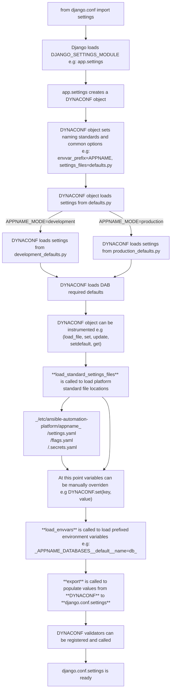
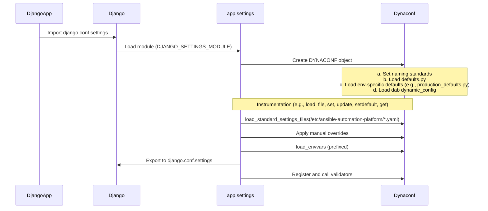

# Dynamic Configuration

Application configuration is managed by [dynaconf] a dynamic configuration system that allows you to define configuration settings in a variety of formats and sources.

Django Ansible Base provides a set of functions to help Ansible Applications to instantiate
the dynaconf object, load settings from standard locations, export settings back to django settings and more.

`myapp/settings.py`:
```python
from ansible_base.lib.dynamic_config import (
    factory,  # Create a dynaconf object
    export,  # Export dynaconf settings back to django.conf.settings
    load_envvars, # Load settings from environment variables
    load_standard_settings_files, # Load settings from standard locations
    validate, # Validate settings according to a set of validators registered
)
```

Those functions are provided separately to allow the application to choose which ones to use and which
order to call them.

## Usage

Assuming `DJANGO_SETTINGS_MODULE` is set to `myapp.settings`:

On the `settings` module (`settings.py` or `settings/__init__.py`), create an object named 
`DYNACONF` using the `ansible_base.lib.dynamic_config.factory` function.

The `factory` function will accept the following arguments:

- **module_name**: The name of the module
  The module_name is used to determine the caller module path.
- **app_name**: The name of the application
  This name is used to determine some configuration defaults such as the main envvar prefix `{NAME}_` and the standard settings file name on `/etc/ansible-automation-platform/{name}/settings.yaml` and the mode switcher on `{name}_MODE`.
- **extra_envvar_prefixes**: A list of environment variable prefixes to search for settings
  If the application needs to load settings filtering additional prefixes, this list can be used to specify them.
- ****options**: Additional options to pass to dynaconf


`myapp/settings.py`:
```python
DYNACONF = factory(
    __name__,
    "MYAPP",
    # Options passed directly to dynaconf
    environments=("development", "production", "testing"),
    settings_files=["defaults.py"],
)
```

With the above configuration DYNACONF will load 

- settings passed directly to the factory function
- settings from `defaults.py` file
- settings from `develoment_defaults.py` file if the file exists and the mode is development (which is the default mode)
- settings from `production_defaults.py` file if the file exists and the mode is production (set with `export MYAPP_MODE=production`)
- required settings from `django_ansible_base` dynamic configuration

## Manipulating the DYNACONF object

Inside the `settings` module the DYNACONF object is available to be instrumented in any way needed,
read more on [dynaconf] documentation to see how to use the settings object.

From outside the `settings` module the DYNACONF object can be accessed from `django.conf.settings.DYNACONF`.

The basic operations are:

### Read a setting 

> DYNACONF is a dict-like object that also exposes attribute lookup.

```python
DYNACONF.get("key")
DYNACONF.key
DYNACONF.key.subkey
DYNACONF["key"]
```

### Set a setting

```python
DYNACONF.set("key", "value")
DYNACONF.set("key__subkey", "value")
DYNACONF.set("key.subkey", "value")
DYNACONF.key = "value"
DYNACONF.key.subkey = "value"
DYNACONF["key"] = "value"
DYNACONF.update({"key": "value"})
DYNACONF.setdefault("key", "value")
```

### Load extra files 

```python
DYNACONF.load_file("path/to/file.yaml")
DYNACONF.load_file("path/to/file.toml")
DYNACONF.load_file("path/to/file.json")
DYNACONF.load_file("path/to/file.ini")
DYNACONF.load_file("local_*.py")
DYNACONF.load_file("/etc/location/conf.d/*.py")
```

> [!NOTE]  
> Every time a key is set, or a new file is loaded, Dynaconf will apply **merging** rules to the settings, so the last loaded file or the last set key will override the previous ones.
> Dynaconf has some merging strategies that can be configured, read more on [dynaconf] documentation.
> By default the latest set key will completely override the previous one.
> unless it explicitly uses one of the `@merge`. "@merge_unique", "@insert" or "dynaconf_merge" directives.
>
> If `merge=True` is passed to the `factory` function, then dynaconf will operate on the global merging > strategy, which means lists and dictionaries will be merged back to previous by default (even without the directives) instead of replaced.
>
> Notice that DAB doesn't use the `merge=True` option by default, so the default behavior is to replace the previous settings, this allows more granular control over the settings merge.


### Check the current mode 

For example `export MYAPP_MODE=production` will set the mode to production,
modes can also be composed like `export MYAPP_MODE=production,extra`

```python
DYNACONF.is_development_mode # True if development
"production" in DYNACONF.current_env.lower() # True if production
```

### Switch mode at runtime

> Useful for testing and inspection, but not useful for production code.

```python
with DYNACONF.using_env("production"):
    # do something
```

## Loading Standard Ansible Automation Platform settings files

The `load_standard_settings_files` function will load settings from the standard locations,
the base location is standardized as `/etc/ansible-automation-platform/` and the function will load
in order.

- `/etc/ansible-automation-platform/{settings, flags, .secrets}.yaml`
- `/etc/ansible-automation-platform/{name}/{settings, flags, .secrets}.yaml`

where `{name}` is the lowercase name passed to the factory function.

```python
load_standard_settings_files(DYNACONF)
```

Those files will be loaded in order and the merging strategy will be applied.

## Load settings from environment variables

The `load_envvars` function will load settings from environment variables using the standard prefix
`{NAME}_` where `{NAME}` is the upper name passed to the factory function.

If extra prefixes are needed they can be passed as a list to the function.

```python
load_envvars(DYNACONF)
```

and then the settings can be externally overridden as:

```bash
export MYAPP_KEY=value
export MYAPP_KEY__SUBKEY=value
export MYAPP_DATABASES__default__NAME=mydb
export MYAPP_NUMBER=42
export MYAPP_LIST="[1, 2, 3]"
export MYAPP_DICT='@json {"key": "value"}'
# or a valid toml
export MYAPP_DICT='{key="value"}'
export MYAPP_BOOL=true
export MYAPP_FLOAT=3.14
export MYAPP_INTERPOLATE="@format The key value is {this.KEY}"
export MYAPP_INTERPOLATE_COMPLEX="@int @jinja {{ this.NUMBER * 4}}"
export MYAPP_INSTALLED_APPS="@merge new_app_to_add"
```

More on [dynaconf] documentation.


## Export settings back to django settings

The export function will take all variables from the dynaconf object and export them back to django settings so it will be available as `django.conf.settings`:

It is important to call this function at the very end of the `settings` module.

```python
export(__name__, DYNACONF)
```

## Validation

Optionally, validators can be specified and checked, the recommendation is to perform the validation at the end of the `settings` module after the call to `export`.

```python
from dynaconf import Validator

DYNACONF.validators.register(
    Validator("KEY", required=True),
    Validator("NUMBER", is_type_of=int, gte=0, lte=100),
    Validator("LIST", len_min=1, when=Validator("OTHER", eq="value")),
    Validator("DICT", condition=lambda x: x.get("key") == "value"),
)

validate(DYNACONF)
```

Check more on the validation section of [dynaconf] documentation.


## Full example 

`myapp/settings.py`:
```python
from dynaconf import Validator
from ansible_base.lib.dynamic_config import factory, export, load_envvars, load_standard_settings_files

DYNACONF = factory(
    __name__,
    "MYAPP",
    # Options passed directly to dynaconf
    environments=("development", "production", "testing"),
    settings_files=["defaults.py"],
)

load_standard_settings_files(DYNACONF)

load_envvars(DYNACONF)

export(__name__, DYNACONF)

DYNACONF.validators.register(
    Validator("KEY", required=True),
    Validator("NUMBER", is_type_of=int, gte=0, lte=100),
    Validator("LIST", len_min=1, when=Validator("OTHER", eq="value")),
    Validator("DICT", condition=lambda x: x.get("key") == "value"),
)
validate(DYNACONF)
```

`myapp/defaults.py`:
```python
DATABASES = {
    "default": {
        "ENGINE": "django.db.backends.sqlite3",
        "NAME": "db.sqlite3",
    }
}
DEBUG = False
ANYTHING = "value"

# all django settings can be set here
# use dynaconf idioms to set them like:
# DATABASES__default__NAME = "db.sqlite3"
# INSTALLED_APPS = "@merge_unique new_app_to_add_only_if_not_present"
```

`myapp/development_defaults.py`:
```python
DEBUG = True
DATABASES__default__NAME = "devdb.sqlite3"
```


`myapp/production_defaults.py`:
```python
DEBUG = False
DATABASES__default__NAME = "proddb.sqlite3"
```

`/etc/ansible-automation-platform/myapp/settings.yaml`:
```yaml
KEY: value
NUMBER: 42
LIST:
    - 1
    - 2
    - 3
DICT:
    key: value

# Merging also available
DATABASES__default__NAME: prod_db
INSTALLED_APPS: "@merge_unique new_app_to_add"
```

`/etc/ansible-automation-platform/myapp/flags.yaml`:
```yaml
FEATURE_FOO_ENABLED: true
FEATURE_BAR_ENABLED: false
```

`/etc/ansible-automation-platform/myapp/.secrets.yaml`:
```yaml
SECRET_KEY: "@vault secret/myapp/secret_key"  # this will be fetched from vault if vault loader is set
PASSWORD: "@op namespace/key"  # this will be fetched from 1password if op loader is set
TOKEN: "R4ND0M_T0K3N"  # Just a string
```

Environment variables:
```bash
export MYAPP_KEY=value
export MYAPP_KEY__SUBKEY=value
export MYAPP_DATABASES__default__NAME=mydb
```

Runtime:
```python
from django.conf import settings

# Regular Django Settings
print(settings.DEBUG)

# Acessing dynaconf object for inspection
print(settings.DYNACONF.KEY)
```

## Dynaconf CLI

Dynaconf also provides a CLI to inspect settings:

To use the CLI it is required to set DJANGO_SETTINGS_MODULE variable.

```bash
export DJANGO_SETTINGS_MODULE=myapp.settings
```

> Optionally, if the variable is not set, `-i path` can be passed to the CLI, e.g: `dynaconf -i myapp.settings.DYNACONF command`


```bash

# List Human Friendly
$ dynaconf list
$ dynaconf list -k KEY
$ dynaconf list -k DATABASES --json
$ dynaconf list -k DATABASES__default__NAME


# Inspect Settings Loading History
$ dynaconf inspect
$ dynaconf inspect -k KEY
$ dynaconf inspect -k DATABASES__default__NAME


# Get raw value as string on stdout
$ dynaconf get KEY
```

Read more on [dynaconf] documentation.


[dynaconf]: https://dynaconf.com

## Diagram

### Flowchart


```mermaid
graph TD;
    A[from django.conf import settings] --> B[Django loads DJANGO_SETTINGS_MODULE e.g: app.settings];
    B --> C[app.settings creates a DYNACONF object];
    C --> C1[DYNACONF object sets naming standards and common options <br> e.g: envvar_prefix=APPNAME, settings_files=defaults.py];
    C1 --> C2[DYNACONF object loads settings from defaults.py];
    C2 -->|APPNAME_MODE=production| C3[DYNACONF loads settings from production_defaults.py];
    C2 -->|APPNAME_MODE=development| C4[DYNACONF loads settings from development_defaults.py];
    C4 --> C5[DYNACONF loads DAB required defaults];
    C3 --> C5
    C5 --> D["DYNACONF object can be instrumented e.g <br> (load_file, set, update, setdefault, get)"];
    D --> E["**load_standard_settings_files** <br> is called to load platform standard file locations"];
    E --> E1["_/etc/ansible-automation-platform/appname_ <br> /settings.yaml <br> /flags.yaml <br> /.secrets.yaml "]
    E1 --> F
    E --> F["At this point variables can be manually overriden <br> e.g DYNACONF.set(key, value)"];
    F --> G["**load_envvars** is called to load prefixed environment variables <br> e.g: _APPNAME_DATABASES__default__name=db_"];
    G --> H["**export** is called to populate values from **DYNACONF** to **django.conf.settings**"];
    H --> I[DYNACONF validators can be registered and called];
    I --> J["django.conf.settings is ready"]
```

### Sequence Diagram


```mermaid
sequenceDiagram
    participant DjangoApp
    participant Django
    participant app_settings as app.settings
    participant Dynaconf

    DjangoApp->>Django: Import django.conf.settings
    Django->>app_settings: Load module (DJANGO_SETTINGS_MODULE)
    app_settings->>Dynaconf: Create DYNACONF object
    Note over Dynaconf: a. Set naming standards<br/>b. Load defaults.py<br/>c. Load env-specific defaults (e.g., production_defaults.py)<br/>d. Load dab dynamic_config
    Note over Dynaconf, app_settings: Instrumentation (e.g., load_file, set, update, setdefault, get)
    app_settings->>Dynaconf: load_standard_settings_files(/etc/ansible-automation-platform/*.yaml)
    app_settings->>Dynaconf: Apply manual overrides
    app_settings->>Dynaconf: load_envvars (prefixed)
    app_settings->>Django: Export to django.conf.settings
    app_settings->>Dynaconf: Register and call validators
```